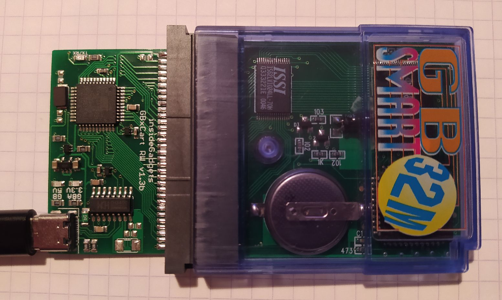
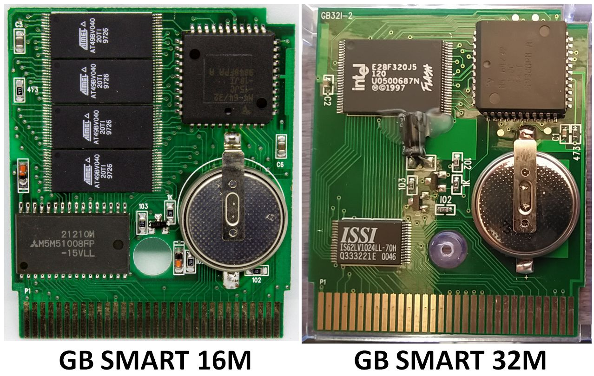
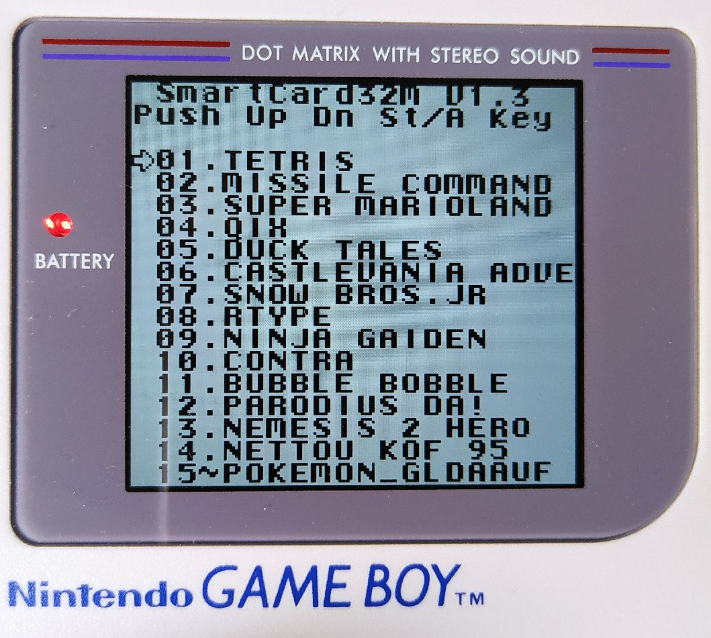

# GB SMART 16/32M multiboot rom manager
A GNU Octave tool to build a multiboot rom for the EMS GB SMART 16M / GB SMART 32M flash cartridges.

The purpose of this project is to rejuvenate the handy multiboot rom support for EMS GB SMART 16/32M flash cartridges that was abandoned years ago. EMS company website is still alive today showing examples of the [weird products they sold until 2007](http://www.hkems.com/m_main.htm)

# What's inside the carts ?

The GB SMART 32M comprises a M4-64/32-15JC-18JI Lattice CPLD which plays the role of generic mapper, a single Intel E28F320J5-120 32Mb (4 MB) flash memory and a ISSI IS62LV1024LL-70H 128kB CMOS static ram. The GB SMART 16M has a more original design: it comprises the same CPLD as mapper, a Mitsubishi M5M51008FP 131kB CMOS static ram and 4 ATMEL AT9BV040-20TI 8Mb (1MB) flash chips. Clearly the GB SMART 32M have a more finished design. Both have no RTC (real time clock).

# The story

In the mid 2000s, the GB SMART 16/32M cards were quite common flashable cartridges for Game Boy. They were bundled with a parallel-port flasher like the odd GB-Transferer. The GB SMART cartridges were able to support some common Game Boy mappers from this era and are still intersting pieces of hardware with a very broad compatility (even by today's standards). They were sometimes grossly relabeled with other brand names but were easily recognizable due to their clear electric blue shell. It is still possible to buy a new GB SMART 32M from old stocks in 2021. It is in particular famous for its LSDJ support. The total amount of GB SMART cards produced is unknown.

The parallel GB-transferer itself had a particular interesting feature: it was not only able to flash single rom and dump cartridges, but it was also able to create a multiboot rom cartridge with a dedicated soft: the EMS GB SMART Writer. The principle was to inject a particular custom multiboot rom first, then the other games to the flash chip. The custom multiboot rom had probably [special instructions to lock certain high address pins](https://gbdev.gg8.se/wiki/articles/Memory_Bank_Controllers#EMS) of the cartridge custom mapper which allow any game to be seen as working with normal addresses range from a Game Boy, whatever its actual position in the flash chip. In its design, functionning of this mapper is very similar to the [MMM01 mapper chip](https://wiki.tauwasser.eu/view/MMM01) but with partial MBC1 emulation as we will see.

Unfortunately, the GB transferer software was not open access and became completely obsolete since the end of support for Windows 2000. More recently the software support for parallel port was also abandon on Windows. So the GB-transferers now sleep in drawers for eternity. In the other hand, GB SMART 16/32M cartridges are still usable today with any compatible [good flasher](https://www.gbxcart.com/) and the custom multiboot rom is easy to find on internet as it is a simple .gb file. The global working principle of the multiboot rom is explained [here in details](https://www.insidegadgets.com/2019/05/24/a-look-into-the-gb-smart-16m-flash-cart-inspecting-the-multi-game-menu-adding-flashing-support-and-a-basic-menu-maker/)

The custom multiboot rom must be at the root of the GB SMART cartridge (first 32 kB) and the other roms are aligned at offsets multiple of there own size (for example 32 kB roms must be aligned at offsets 0x8000, 0x10000, 0x18000, etc., 512 kB roms must be aligned at offsets 0x80000, 0x10000, etc.). Consequence : GB SMART 16M (2MB) can at most handle one 1MB rom (plus other smaller roms) and GB SMART 32M (4MB) one 2MB rom + one 1MB rom (plus other smaller roms). 

When booting the system, the custom multiboot rom searches for a Game Boy boot logo every 32 kB after itself, deduces starting adresses for rom (and mapper locking instructions), creates a multiboot menu and allows the player to boot the desired rom. The projet here provides open access tools to recreate a fully working multiboot rom system that fits a maximum number of roms into the GB SMART cards without using the original crappy software. 

# How to use the rom manager ?

Simply dump Game Boy roms in the /roms folder and run the code. The principle is simple: big roms first and first seen first placed. The multiboot "filesystem" is filled with big roms at higher addresses first to optimize the placement, then the size of rom and addresses are progressively reduced. If the number of roms written is equal to the cartridge capacity, the code ends. The code generates a big OUTPUT.GB containing the whole « filesystem » that is ready to flash to your GB SMART card. You can check the rom with BGB emulator to be sure that everything is OK.

Two versions of code are proposed : one for GB SMART 16M and one for GB SMART 32M. I developped the software on GB SMART 32M (I do not own a 16M) but I assume the rules are the same for the GB SMART 16M (Except for the total size). I'm just not totally sure wether the GB SMART 16M can split a 1MB rom on two chips or not, so in case of failure to read 1MB roms, just use 512 kB roms at most and open an issue so that I will correct the code.

The code could seem weird for Matlab veterans but it was made to be fully compatible with GNU Octave so some advance features of Matlab were not usable (like quick sorting of structures for example).

# Mapper compatibility

The multiboot support was a very unreliable feature at the time. I do not even remind been able to make it work one single time correctly on real hardware. I though it was due to some noise on my parallel port so I used the GB-transferer essentially to extract images from my Game Boy Camera and dump roms and sram from games.

In fact the multiboot support becomes surprinsingly reliable with a good tool to organise roms (like mine ^_^) and a [good flasher software](https://github.com/lesserkuma/FlashGBX/releases).

It seems after various tests that the **GB SMART series is compatible with MBC3 (without RTC) and MBC5 games**. [According to this test](https://github.com/ZoomTen/mbc30test), it is even **MBC30 compatible !** It is possible to [patch some MBC1 games to restore compatibility](https://gbatemp.net/threads/gameboy-patch-a-game-from-mbc1-to-mbc5-memory-bank-controllers.542876/) with MBC5 mapper and thus made them work with GB SMART card. MMM01 mapper seems to work too (I went not to far in [the only game supported](https://gbhwdb.gekkio.fi/cartridges/mmm01.html)). All other [weird mappers](https://gbhwdb.gekkio.fi/cartridges/) using special inputs/outputs are excluded from the compatibility list for obvious reasons (HuCx, Wisdom Tree, MAC-GBD, MBC6, MBC7, TAMA5).

Be carefull, all games share the same single sram for saving, so any save erases the other. So the good way of using the multiboot support is to have just one game using the save feature on the card and many other regular games aside. **GBC games boot by default in DMG mode from the multiboot menu (only mode supported), even on GBC or GBA. Flashing one game only without the multiboot allows to use the GB SMART cart in GBC mode, as a regular flash cartridge.**

Last but not least, the multiboot feature is of course supported by GB SMART cards ONLY due to their particular custom mapper, so any other flash cart will not work… By using a regular flashable cartridge, you will just return to the boot menu while booting a game as address range locking is not available. Surprisingly the BGB emulator fully supports this weird mapper.

# Funfact

I bought the GB Smart 32M cartridge plus the parallel GB Transferer around 2007 via Paypal from HK with some common shipping options (it was rather cheap). I received the device in France 3 days later (with the HK stamps). Today, I still don't understand how this could be humanly possible.

# Example of a well stuffed GB SMART 32M made with the codes (all games working).
Some menu explanations:
- =>XX . romname: stands for DMG or GBC games without save feature
- =>XX - romname: stands for DMG games using save feature
- =>XX ~ romname: stands for GBC games using save feature

